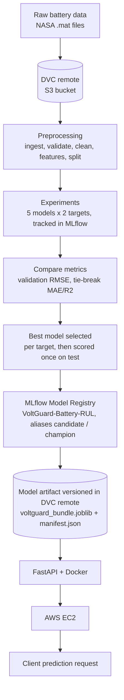
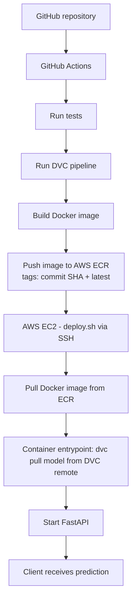

# Architecture

The architecture is exactly the two-part flow in the project brief. Nothing was added (no Kubernetes) except lightweight Prometheus metrics *inside* the FastAPI service.

## Part 1 - ML / MLOps pipeline

## Part 2 - CI/CD

## Mapping: your architecture step -> implementation

| Architecture step | Implementation |
|---|---|
| Raw Battery Data | `data/raw/*.mat` (`scripts/download_data.py`, `data/README.md`) |
| DVC Remote | S3 remote `storage` in `.dvc/config`; `dvc add data/raw`, `dvc push/pull` |
| Preprocessing | DVC stages `data_ingestion`, `preprocess` -> `src/data`, `src/features`, `src/pipeline/preprocess.py` |
| Experiments | DVC stage `train` -> `src/models/train.py` (MLflow runs, params, time, MAE/RMSE/R2, importances) |
| Compare metrics | `artifacts/metrics/train_metrics.json`; MLflow UI |
| Best model selected | Stage `evaluate` -> `src/models/select.py` (rule in `params.yaml: selection`) |
| Model registry | Stage `register_model` -> `src/models/registry.py` (MLflow registered model + aliases) |
| Model artifact stored/versioned remotely | `artifacts/models/voltguard_bundle.joblib` + `manifest.json` as DVC outs -> `dvc push` |
| FastAPI + Docker | `api/`, `Dockerfile`, `docker/entrypoint.sh` |
| AWS EC2 | `scripts/deploy.sh`, `scripts/setup_ec2.sh`, `docs/aws-deployment.md` |
| Client prediction request | `POST /predict` |
| GitHub Repository / Actions | `.github/workflows/ci.yml`, `cd.yml` |
| Run tests / Run DVC pipeline | `cd.yml` jobs `test`, `pipeline` (`pytest`, `dvc repro`) |
| Build image / Push to ECR | `cd.yml` job `build-push` (`docker build`, `aws-actions/amazon-ecr-login`) |
| EC2 pulls image from ECR | `scripts/deploy.sh` (`docker pull`) |
| Pull model artifact from DVC remote | `scripts/bootstrap_model.py` (`dvc pull`), run by the container entrypoint |
| Start FastAPI | `uvicorn api.main:app` after bootstrap succeeds |

## DVC vs MLflow (the key distinction)

| | DVC | MLflow |
|---|---|---|
| Purpose | Version **data and artifacts**, define reproducible **pipeline** | Track **experiments**, register **models** |
| Stores | Files in S3 (content-addressed), pointers in Git (`dvc.lock`, `*.dvc`) | Params, metrics, run IDs, model versions, aliases in a tracking DB |
| Answers | "Which exact data + code + params produced this file?" | "Which run was best? Which model version is champion?" |
| Used at deploy time for | Fetching the model file | Nothing at runtime - but `manifest.json` records the registry version/run so the two are linked |

**Bridge:** `register_model` writes `manifest.json` (registry name, version, run ID, aliases, SHA-256 of the bundle). It is a DVC output, so the image's `dvc.lock` pins exactly one manifest + bundle. At startup the API refuses to serve unless the configured alias (`MODEL_ALIAS`, default `champion`) is in the manifest and the checksum matches.

## Per-technology summary (what / why / where / how)

| Tech | What | Why | Where | Interacts with |
|---|---|---|---|---|
| Git/GitHub | Code versioning + hosting | History, review, triggers CI | Repo root | Holds `dvc.yaml`, `dvc.lock`, `*.dvc`; triggers Actions |
| DVC | Data/model versioning + pipeline DAG | Git can't hold big files; reproducibility | `dvc.yaml`, S3 | Git (pointers), S3 (content), MLflow (stages call it), EC2 (pull) |
| MLflow | Experiment tracking + registry | Compare runs, govern versions/aliases | `train`, `evaluate`, `register_model` | DVC stages run it; manifest links back |
| FastAPI | Serving API | Typed, validated, fast, auto-docs | `api/` | Loads bundle; exposes Prometheus metrics |
| Docker | Packaging | Same runtime on laptop and EC2 | `Dockerfile` | ECR stores it, EC2 runs it |
| ECR | Private image registry | Versioned, IAM-secured images | CI push, EC2 pull | GitHub Actions, EC2 |
| EC2 | VM host | Simple, cheap, matches brief | `deploy.sh` | ECR, S3 (via IAM role), clients |
| S3 | Object storage | DVC remote | Bucket | DVC in CI and in container |
| GitHub Actions | CI/CD | Automate test -> train -> build -> deploy | `.github/workflows` | AWS, ECR, EC2 |
| pytest | Tests | Catch regressions before deploy | `tests/` | Runs in CI |
| Prometheus client | Metrics | Lightweight monitoring | `/metrics` | Scrapable by any Prometheus/CloudWatch agent |
